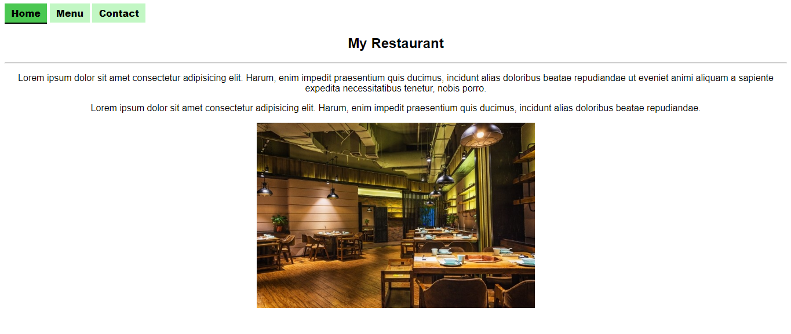

 

# Restaurant Page JavaScript

> In this project I built a restaurant page with javascript. It has three tabs- Home, Menu and Contact. When user clicks on any tab, application dynamically updates the UI.
> App uses JavaScript modules to seprate the logic of each component, and webpack to manage module files and to build bundle file.

## Built With

- HTML
- CSS
- JavaScript
- Webpack
- Babel

## Live Demo

[Click here](https://raw.githack.com/alishabab/restaurant-page-javascript/restaurant-feature/dist/index.html)

## Getting Started

To get a local copy up and running follow these steps:

### Prerequisites

- Basic knowledge of Html, CSS and JavaScript
- A Code Editor
- Git

### Usage

- Fork/Clone this project to your local machine
- Open `index.html` in your browser

## Authors

👤 **Shabab Ali**

- Github: [@alishabab](https://github.com/alishabab)
- Twitter: [@shabab_ali](https://twitter.com/shabab_ali)
- LinkedIn: [shababali](https://www.linkedin.com/in/shababali/)
- Email: [shababsaifi@gmail.com](mailto:shababsaifi@gmail.com)

## 🤝 Contributing

Contributions and feature requests are welcome!

Start by:

- Forking the project
- Cloning the project to your local machine
- `cd` into the project directory
- Run `git checkout -b your-branch-name`
- Make your contributions
- Push your branch up to your forked repository
- Open a Pull Request with a detailed description to the development(or master if not available) branch of the original project for a review

## Show your support

Give a ⭐️ if you like this project!

## Acknowledgments

[The Odin Project](https://www.theodinproject.com/courses/javascript/lessons/restaurant-page)
